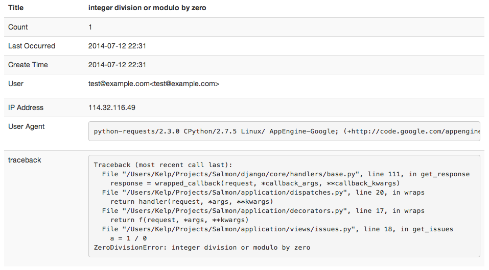

#Victorique [](http://travis-ci.org/kelp404/Victorique) [](https://david-dm.org/kelp404/Victorique#info=devDependencies&view=table)

[MIT License](http://www.opensource.org/licenses/mit-license.php)


Victorique is an error reporting server on Google App Engine. You could download this project then deploy to GAE with free plan. Your app could send the error information to Victorique with RESTful API. And this project is the second generation of [Victory](https://github.com/kelp404/Victory).  
Victorique is memento for ヴィクトリカ of [GOSICK](http://www.gosick.tv/).


##Installation
```bash
$ git clone https://github.com/kelp404/Victorique.git
$ git submodule update --init
```


##API document
>####[Victorique on Apiary](http://docs.victorique.apiary.io/)


##Example API Calls
**curl**
>```bash
$ curl -XPOST https://{your_host}/api/applications/{your_app_key}/logs --header "Content-Type:application/json" -d '
{
  "title": "__52-[ManaNetwork getEventsWithQuery:completionHandler:]_block_invoke +696",
  "user": "kelp<kelp@phate.org>",
  "document": {
    "exception": "Error Domain=NSURLErrorDomain Code=-1001 \"The request timed out.\" UserInfo=0x155d43d0 {NSErrorFailingURLStringKey=http://www......",
    "time": "2014-06-07T08:51:38.000Z",
    "device": "iPhone 7.1.1",
    "...": "..."
  }
}'
```

**AngularJS & jQuery**
>```coffee
$http(args).error (data, status, headers, config) =>
    delete config.data?.password
    document =
        'Request Headers': config.headers
        'Request Params': config.params
        'Request Data': config.data
        'Response Status': status
    $.ajax
        method: 'get'
        dataType: 'jsonp'
        url: 'https://#{yourHost}/api/applications/#{yourAppKey}/logs'
        data:
            title: "#{config.method} #{location.origin}#{config.url} failed"
            user: "#{@user.name} <#{@user.email}>"
            document: JSON.stringify(document)
```

**Python django**
>```python
# Victorique class
# you should import https://github.com/kennethreitz/requests
import json, requests
class Victorique(object):
    def __init__(self, api_url, user):
        self.api_url = api_url
        self.user = user
    def send(self, title, document=None):
        headers = {'Content-type': 'application/json'}
        data = {
            'title': title,
            'user': self.user,
            'document': document,
        }
        try:
            requests.post(self.api_url, data=json.dumps(data), headers=headers)
        except Exception as e:
            import logging
            logging.error('error report send failed. %s' % e.message)
```
```python
# update your wsgi for send exception logs
import os, traceback
from django.core.wsgi import get_wsgi_application
from application.victorique import Victorique # Victorique class
os.environ.setdefault("DJANGO_SETTINGS_MODULE", "application.settings") # django settings
app = get_wsgi_application() # wsgi
# update handle_uncaught_exception for handle exceptions.
origin_handler = app.handle_uncaught_exception
def exception_handler(request, resolver, exc_info):
    api_url = 'https://{your_host}/api/applications/{your_app_key}/logs'
    exc_type, exc_value, exc_traceback = exc_info
    v = Victorique(api_url, unicode(request.user) if hasattr(request, 'user') else '')
    v.send('exception: %s' % str(exc_value), {
        'method': request.method,
        'path': request.get_host() + request.get_full_path(),
        'traceback': traceback.format_exc(20),
    })
    return origin_handler(request, resolver, exc_info)
app.handle_uncaught_exception = exception_handler
```



##Deploy
>You should create a GAE account.
https://appengine.google.com

**update [app.yaml](https://github.com/kelp404/Victorique/blob/master/app.yaml)**
>
Find `application: victorique-demo` then replace `victorique-demo` to your Application Identifier.

**update [application/settings.py](https://github.com/kelp404/Victorique/blob/master/application/settings.py)**
>
```python
GAE_ACCOUNT = 'kelp.phate@gmail.com' # your gae account
HOST = 'victorique-demo.appspot.com' # your domain
ALLOW_REGISTER = False # `False` will not allow register
```

**upload victorique**
>https://developers.google.com/appengine/docs/python/gettingstartedpython27/uploading
```bash
$ appcfg.py update .
$ appcfg.py backends update .
```


##Development
>```bash
# Install node modules, bower components and pip packages.
$ npm install
$ bower install
$ pip install -r pip_requirements.txt
```
```bash
# compile frontend files
$ grunt dev
```

>```coffee
$rootScope =
    $state:
        # the $state of ui-router
    $stateParams:
        # the $stateParams of ui-router
    $confirmModal:
        # the confirm modal
        message: {string}
        callback: (result) ->
        isShow: {bool}
    $loadings:
        # current $http instances
        hasAny: -> # is any $http processing?
    $applications:
        # all paged applications
    $user:
        # current user object
```


##Test
>```bash
# frontend unit-test
$ grunt test
# python unit-test
$ python application/test.py
```
